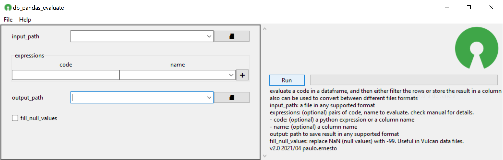

# db_pandas_evaluate
evaluate code in a dataframe, and then either filter the rows or store the result in a column
## Objetivo
Este script possui alguma funcionalidades gerais que podem ser utilizadas em automatizações tais como scripts csh.
 - Criar novas colunas baseadas em uma expressão
 - Criar colunas em branco caso não existam ainda
 - Renomear colunas
 - Filtrar linhas baseado em um expressão
 - Converter arquivos entre os formatos suportados:
  * Xlsx, xls, csv
  * Shp
  * Dgd
  * 00t
  * Bmf
  * Obj
  * json

